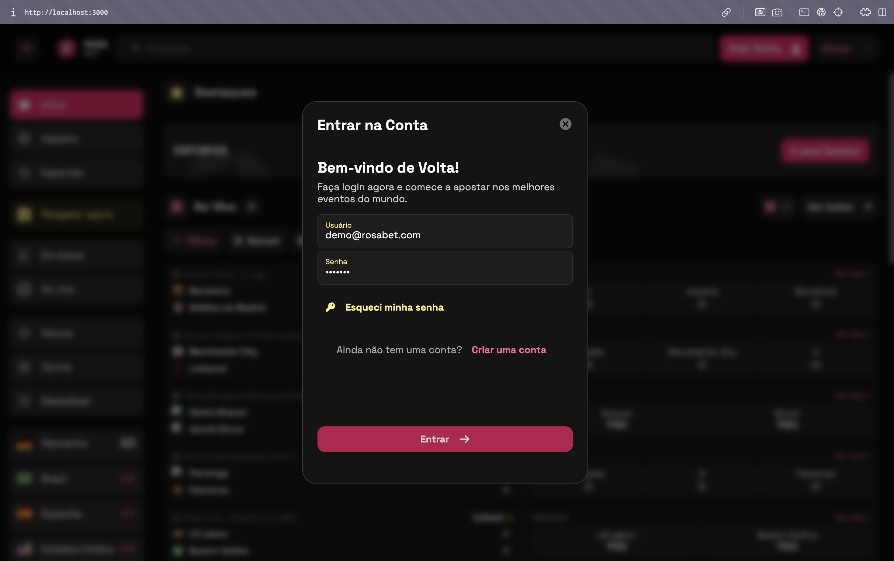
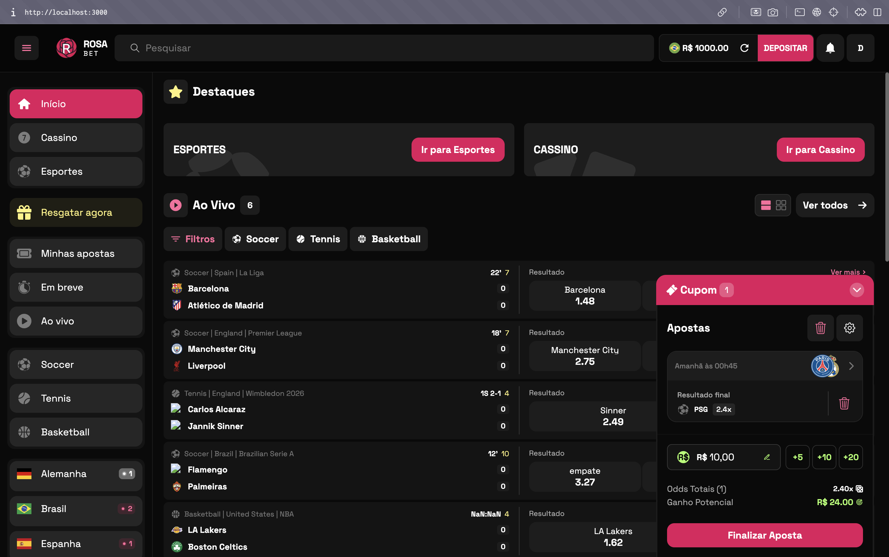
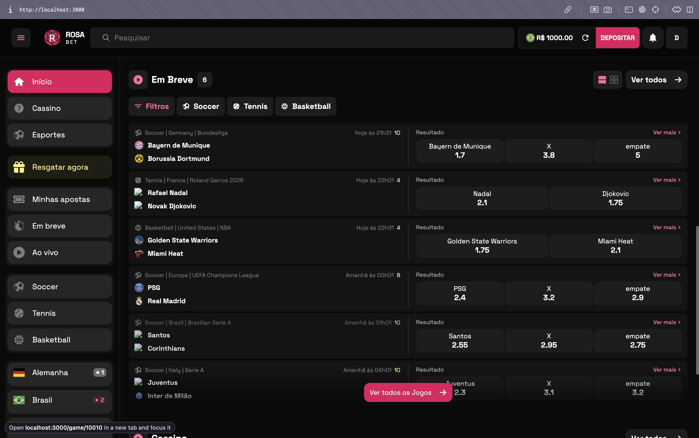
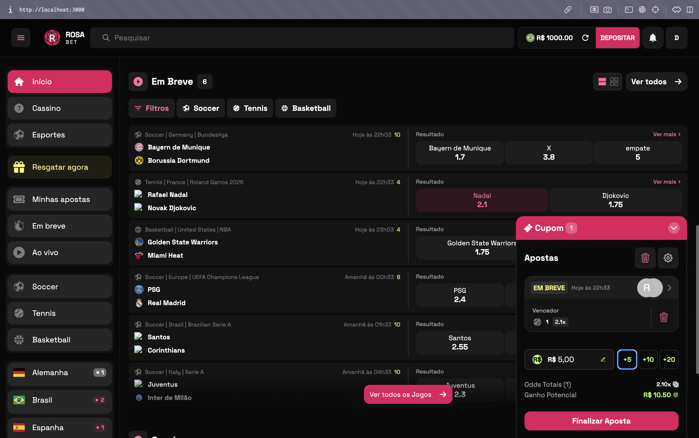
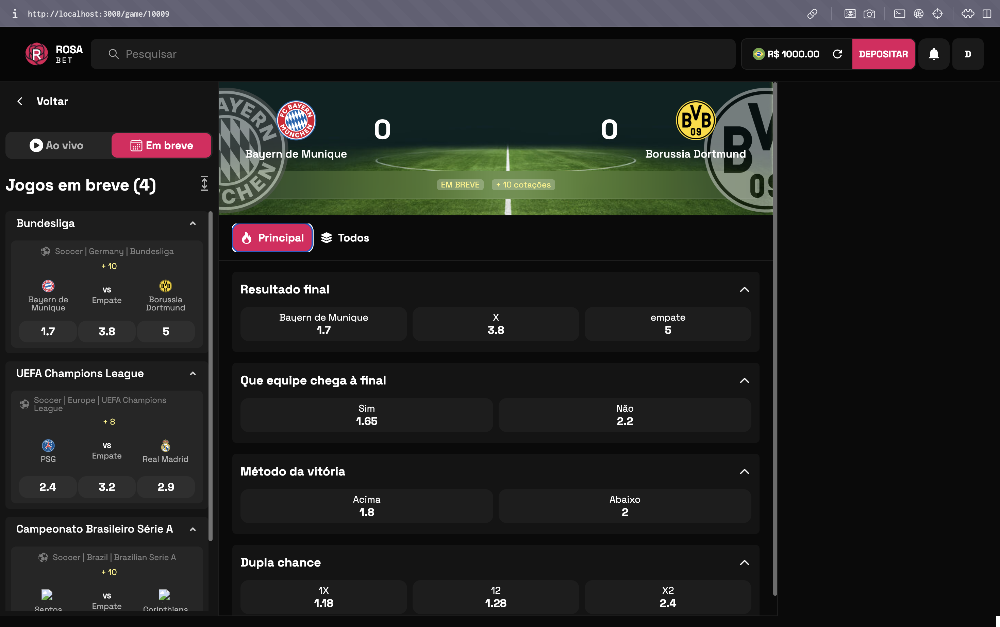
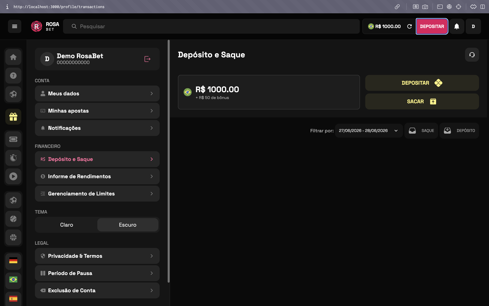

<div align="center">
  
</div>

<br />

# RosaBet — Frontend

> Plataforma completa de apostas esportivas e cassino online. Next.js 14 + FastAPI + WebSocket em tempo real.

---

## Telas

### Login

Modal de autenticação com acesso rápido. Credenciais de demo: `demo@rosabet.com` / `demo123`.



---

### Home — Ao Vivo

Eventos ao vivo com odds atualizadas a cada 5 segundos via WebSocket. O painel de cupom à direita acumula as seleções e exibe cotação total e ganho potencial em tempo real.



---

### Home — Em Breve

Listagem de partidas pré-jogo com odds e horários. Filtragem por esporte (Soccer, Tennis, Basketball) na barra de filtros.



---

### Em Breve — Aposta Selecionada

Seleção de odd em um evento pré-jogo. O cupom abre automaticamente à direita com a cotação travada e o campo de valor.



---

### Detalhes do Jogo

Página de detalhes com todos os mercados disponíveis para a partida: Resultado Final, Dupla Chance, Método da Vitória, Over/Under e outros. Sidebar lateral com jogos relacionados agrupados por campeonato.



---

### Cassino

Catálogo com slots, roleta, ao vivo, bingo, mesa, instantâneos e raspadinhas. Filtro por categoria na barra superior. Seções de Destaques e Em Alta com scroll horizontal.


---

### Perfil do Usuário

Área do usuário com Depósito e Saque via PIX simulado, histórico de apostas, notificações, informe de rendimentos, gerenciamento de limites, período de pausa e exclusão de conta.



---

## Como rodar

**Pré-requisito:** Node.js 20.13.1 — use `nvm use 20.13.1`

```bash
npm install
npm run dev
```

O frontend sobe em `http://localhost:3000`.

O backend FastAPI deve estar rodando em `http://localhost:8000` — veja o [README do backend](../BE-RosaBet/README.md).

---

## Variáveis de ambiente

Crie um `.env.local` na raiz do projeto:

```env
NEXT_PUBLIC_BASE_URL=http://localhost:8000
NEXT_PUBLIC_SOCKET_URL=ws://localhost:8000/ws
NEXT_WEBSITE_URL=http://localhost:3000/
```

---

## Estrutura de pastas

```
RosaBet/
├── src/
│   ├── app/                        # Rotas do Next.js (App Router)
│   │   ├── (auth)/                 # Login e cadastro
│   │   ├── (private)/              # Área logada (perfil, apostas, cassino)
│   │   └── (public)/               # Área aberta (home, esportes, jogo)
│   │
│   ├── components/                 # Componentes reutilizáveis
│   │   ├── oddButton/              # Botão de odd com animação de variação
│   │   ├── sidebar/                # Menu lateral e navegação
│   │   └── ...
│   │
│   ├── contexts/                   # Contextos React globais
│   │   ├── CuponsContext.tsx       # Carrinho de apostas (betslip)
│   │   ├── UserContext.tsx         # Sessão do usuário autenticado
│   │   ├── GameContext.tsx         # Estado dos eventos via WebSocket
│   │   └── StorageContext.tsx      # Persistência em localStorage
│   │
│   ├── hooks/                      # Custom hooks
│   ├── service/                    # Clientes HTTP (bet, deposit, auth...)
│   ├── utils/                      # Helpers e tradução de mercados
│   └── interfaces/                 # Tipos TypeScript globais
│
├── public/                         # Assets estáticos e imagens
└── .env.local                      # Variáveis de ambiente (não vai pro git)
```

---

## Stack

| Tecnologia | Versão |
|---|---|
| Next.js | 14.2.3 |
| React | 18.3.1 |
| TypeScript | — |
| Styled Components | — |
| Lodash | — |
| Node.js | 20.13.1 |

---

## Como funciona o WebSocket

O frontend mantém conexões WebSocket com o backend para receber atualizações em tempo real:

| Canal | Quando ativo | O que recebe |
|---|---|---|
| `events_sports` | Home page aberta | Lista de todos os eventos a cada 5s |
| `events_sports_markets` | Página de detalhe do jogo | Odds do evento específico a cada 5s |
| `properties` | Sempre | Status da conexão (60s) |

As odds piscam em **verde** quando sobem e **vermelho** quando caem, com um indicador fixo que persiste por 20 segundos após a última variação.

O carrinho de apostas (cupom) aceita até 12 seleções. Ao adicionar uma segunda odd do mesmo evento, ela substitui a anterior automaticamente. Seleções de eventos ao vivo não são restauradas do localStorage ao recarregar a página.
